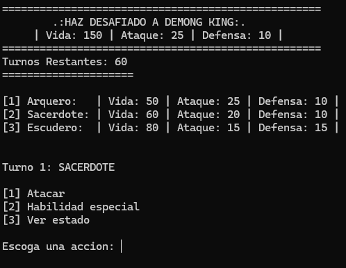
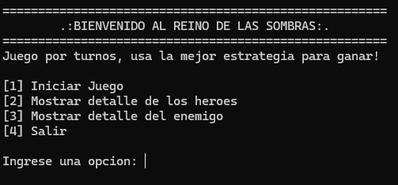

<div align="center">
  <h1>⚔️ Shadow Realm Tactics: Terminal RPG</h1>
  <p><em>A command-line turn-based combat game developed in C++</em></p>
  
</div>

<br>

## 📸 Gameplay Showcase

<div align="center">
  
   
  <br>
  <br>
  <em>Gameplay captures showing the turn-based combat, terminal interface, and state management.</em>
</div>

<br>

## 🎮 About the Game

Take control of a party of three heroes (Archer, Priest, and Squire) as they face off against the formidable Demon King. You must manage your party's health, utilize unique abilities, and mitigate status effects (debuffs) to secure victory.

### ✨ Key Technical Features

<ul>
  <li><strong>Object-Oriented Design:</strong> Extensive use of Inheritance, Polymorphism, and Encapsulation.</li>
  <li><strong>Efficient State Management:</strong> Utilizes <code>std::bitset</code> for highly optimized tracking of character status effects (Poisoned, Weakened, etc.).</li>
  <li><strong>Dynamic Party System:</strong> Uses <code>std::vector</code> to manage the active party, dynamically removing fallen heroes from the turn rotation.</li>
  <li><strong>Randomized Enemy AI:</strong> The Demon King reacts dynamically, choosing between physical attacks or applying debuffs based on RNG probabilities.</li>
</ul>

<br>

## 🚀 How to Run (Windows)

Since this project uses Windows-specific commands (<code>system("cls")</code>), it is recommended to compile and run it on a Windows environment.

1. Clone the repository:
```bash
# Replace YOUR_USERNAME with your actual GitHub username
git clone [https://github.com/YOUR_USERNAME/console-combat-sim.git](https://github.com/YOUR_USERNAME/console-combat-sim.git)
